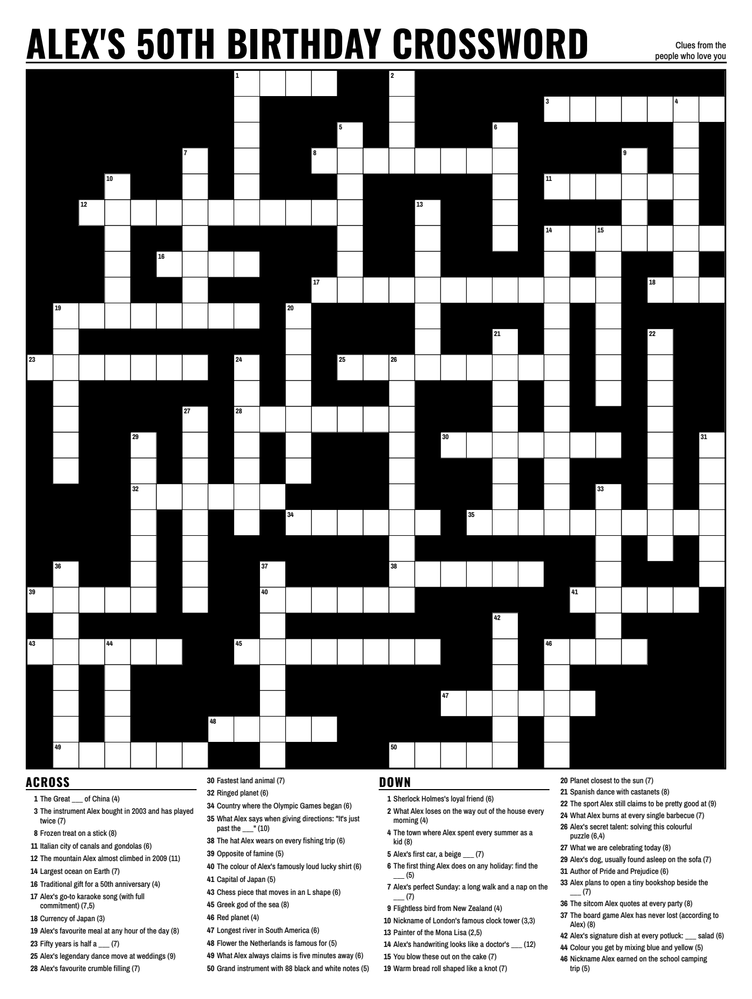
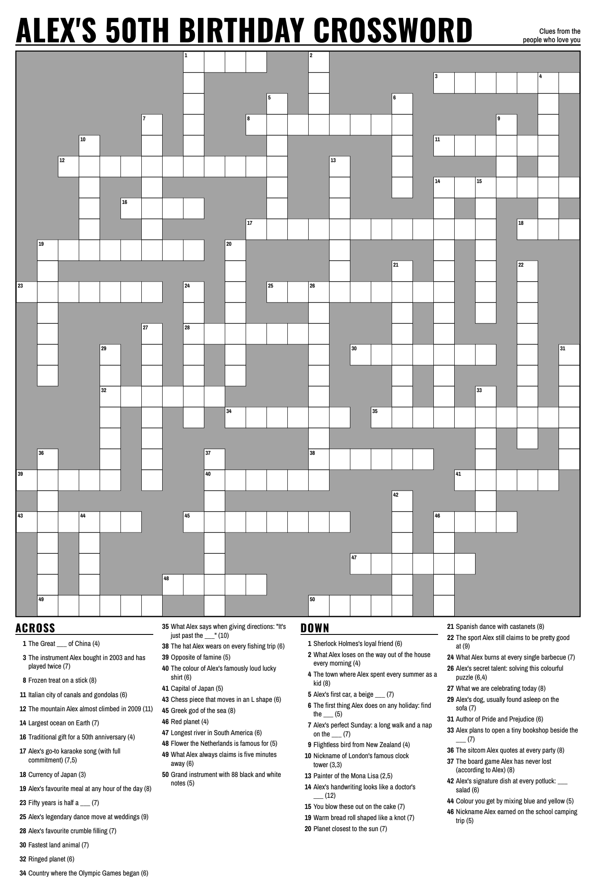

# crossword-poster

Turn a spreadsheet of clues and answers into a large-format **newspaper-style crossword poster**, ready to print.

Give it a CSV with one clue and one answer per row. It builds a free-form (loose, "barred-free") crossword grid in which
**every one of your answers is used**, validates it, lays the poster out in Chromium, and writes print-ready PDFs
(with and without bleed), a PNG preview, an 11x17 answer key, a letter-size solution sheet and a 100%-scale
"actual size" check page you can print on a desktop printer before ordering the big print.



*The sample above is built from the fictional birthday clues in `examples/sample_birthday.csv` ("Alex's 50th"):
18x24 in, solid black blocks. Below: the same data at 24x36 in with grey blocks, which saves ink.*



## Features

- One command, end to end: pool -> grid -> validate -> render -> verify.
- Every answer is placed when possible: the generator searches many randomized layouts and keeps the most compact complete one; if none exists it says which answers were left out.
- Any trim size (tuned for 18x24, 24x36 and 36x48 in; others are scaled), 0.125 in bleed, trim-size PDF, PNG preview.
- Layout fit loop: finds the largest box size that still lets all clues fit at a readable size, wrapping clue columns
  beside the grid when that gives bigger boxes.
- Variants: solid black, grey (ink saving), or black with reversed-out spot icons; `--block-fill` for any colour.
- Extras: answer key (11x17), solution sheet (letter), actual-size check page, independent grid validator, output
  verifier (page sizes, embedded fonts, colours, margins, every clue exactly once, per-cell strokes).

## Install

```bash
pip install git+https://github.com/faramarz/crossword-poster
python -m playwright install chromium     # one-time download of the browser that prints the poster
crossword-poster doctor                   # checks Python, fonts and Chromium, and tells you how to fix anything
```

Python 3.9+. **Chromium is required** for layout and PDF output. Set `CROSSWORD_POSTER_CHROMIUM` to the path of an
existing Chromium/Chrome to use that instead. The fonts (Archivo Narrow, Oswald, SIL OFL) ship inside the package.
For `.xlsx` clue files: `pip install "crossword-poster[xlsx]"`. Licences: [THIRD_PARTY_LICENSES.md](THIRD_PARTY_LICENSES.md).

## Quick start

```bash
crossword-poster sample --out my-first-poster          # builds the bundled birthday example
crossword-poster template my_clues.csv                 # a starter file to fill in
crossword-poster build --clues my_clues.csv --title "Sam's 50th" --subtitle "From everyone who loves you" \
    --size 24x36 --style grey --out poster/
```

Results appear in `poster/`:

```
poster_24x36_grey_bleed.pdf        print this one: trim + 0.125 in bleed on every side
poster_24x36_grey_trim.pdf         exactly 24 x 36 in, for printers that add their own bleed
poster_24x36_grey_preview.png      picture preview
answer_key_24x36_11x17.pdf         the poster scaled to 11x17 with the answers filled in
answer_sheet_letter.pdf  .png      letter-size filled grid
actual_size_check_24x36.pdf        letter page: print at 100% to judge the real box and type sizes
clues_and_answers.csv              numbered list of every clue and answer
details/                           working files: grid.json, pool_report.json, per-size folders, checks/
```

The run ends with a summary: the files written, the square size in inches and mm, the clue font size, and any answers
that could not be placed. Styles: `grey` (default), `black`, `icons` (black with a cake and party hat), or `all`.
Several sizes in one go: `--size 18x24,24x36,36x48`. `scripts/build_all.sh CLUES.csv OUT` builds every size and style.

### Your own clues

Put private data in `data/` (gitignored; see [data/README.md](data/README.md)):

```bash
crossword-poster build --clues data/my_clues.csv --clue-column Clue --answer-column Answer \
    --id-column No --size 24x36 --style black --title "Pub Quiz" --subtitle "Questions from the quiz team" --out out/
```

Input: a CSV (UTF-8 with or without BOM, or Excel's CSV; `.xlsx` with the extra) with a header row. The clue and answer
columns are found by name, case-insensitively (`clue`/`clues`/`question`, `answer`/`answers`/`word`); optional columns
are `id` and `enumeration`. Blank rows are skipped; rows with a missing clue or answer are listed by row number. The
grid word is the answer folded to A-Z (`BIGBEE` style, accents and punctuation dropped); multi-word answers get an
enumeration such as `(3,3)` unless the clue already has one. Answers with digits or other alphabets, shorter than 2 or
longer than 20 letters (`--min-len/--max-len`) are skipped with an explanation; duplicate answers keep the first.
If not every answer fits, the search retries with more attempts and a bigger window, then builds the poster without
the leftovers and lists them (`--require-all` turns that into an error). Clue text is always printed literally.

### Running the steps individually

```bash
crossword-poster pool      --clues my_clues.csv --out out/pool.csv
crossword-poster generate  --csv out/pool.csv --all --attempts 2000 --seed 1 --workers 4 --clue-column clue --out-json out/raw.json
crossword-poster validate  out/details/grid.json --pool out/details/pool.csv
crossword-poster render    out/details/grid.json --trim 24x36 --outroot out/details --make A,C,key --title "My Crossword"
crossword-poster render    out/details/grid.json --solution --outroot out/details --title "My Crossword"
crossword-poster actual-size --from-fit out/details/24x36 --variant A_black --title "My Crossword"
crossword-poster verify    out/details --title "My Crossword"
crossword-poster transpose out/details/grid.json out/transposed      # wide <-> tall layout
```

`generate` alone writes only the bare grid; `build` attaches the clues and writes `details/grid.json`, which `validate`,
`render` and `verify` expect. `python -m crossword_poster ...` is equivalent to `crossword-poster ...`.

## CLI reference

`crossword-poster --help` lists the commands; `crossword-poster <command> --help` shows every option. Exit status:
0 success, 1 built but needs attention (checks failed, or `--require-all` with leftovers), 2 problem with the input or
options, 3 the computer is missing something (Chromium; run `doctor`).

| Command | Purpose |
|---|---|
| `build` | the whole pipeline (see `build --help`: `--clues --title --subtitle --size --style --out --seed --require-all` plus reading, search, look and skip options) |
| `sample` | build the bundled fictional birthday crossword (`--out --size --style --seed`) |
| `template OUT.csv` | write a starter clues file |
| `doctor` | check Python, libraries, fonts and Chromium |
| `pool`, `generate`, `validate`, `render`, `verify`, `actual-size`, `crops`, `transpose` | single stages for power users |

## Design notes

**Newspaper layout.** A full-width header carries a heavy condensed title (Oswald Bold, auto-sized to the widest size that
still leaves room for the byline) over a rule. The grid is a solid-fill rectangle: every cell that is not part of a word
is a filled block, so the grid reads as one bold shape and prints cleanly. Letter cells have a 0.75-1.5 pt outline
(never below 0.5 pt, which the verifier enforces) and a heavy outer frame. Clues are set in Archivo Narrow in columns of
one width and one gutter, "poured" top to bottom. A heading never sits alone at the foot of a column, and a clue is never
split between columns. Slack at the foot of each column is spread between clues so the columns end level.

**Fit loop.** For each candidate number of text columns and grid width the layout code computes the box size, then
bisects for the largest clue font (and line height) at which every clue still fits. It prefers the largest boxes and,
among near-equal choices, the larger type. A few dozen clues on a very large trim will hit the font ceiling and leave
white space at the bottom: use a smaller trim or add clues.

**Bleed, trim and files.** `poster.pdf` is trim + 0.125 in bleed on every side (the block fill and white background run
into the bleed); `poster_trim.pdf` is exactly the trim size for print shops that add their own bleed. Content stays at
least 0.5 in inside the trim (more on 36x48). All fonts are embedded as real TrueType (never Type 3).

**Black-and-white and grayscale printing tips.**
- Matte paper (or matte poster stock) keeps glare off a large black-and-white sheet and hides fingerprints. Satin or
  gloss shows reflections and banding in big solid areas.
- Large flooded black can print streaky or take a long time to dry on some wide-format inkjets. The grey style
  (`--style grey`) uses far less ink and is easier to write on with a pen; `--block-fill` lets you pick the exact tone.
- Ask the shop to print in grayscale / black-only mode and to **not** colour-manage, so there is no colour cast on the greys.
- Send `poster.pdf` (with bleed) unless they ask for the trim file; check the size in the PDF viewer
  (File > Properties) before paying. `verify` does this check for you.
- Print `actual_size_check_letter.pdf` at 100% ("Actual size", never "Fit to page"): the bar must measure exactly one inch,
  and the two windows show real boxes and real clue type, so you can judge legibility from arm's length.
- `key.pdf` is the finished poster scaled onto 11x17 with the answers filled in.

**Generator.** `generate.py` is standard-library only. A sparse board holds placed words. To place a word it finds every cell
that already holds one of its letters and tries to cross there; a placement is legal only if the word's ends are bounded by
an empty cell or the window edge, no new cell touches another word sideways, letters agree where words cross, and a cell is
used by at most one Across and one Down word. Among legal crossings it prefers the one with the most crossings, then the
smallest bounding box, with a random tie-break. One attempt orders the words longest first with random noise, places the
first one centred, and makes several passes over the leftovers. In the default mode the best of N attempts by score
(`words*100 + 40*density + 10*crossings per word`) wins and `--required` words must be present. With `--all`, an attempt only counts if it placed
every word; the smallest bounding box among complete layouts wins. Attempt *k* of seed *s* is seeded by `(s, k)`, so the result
does not depend on the worker count. When no window is given it is estimated (area ~ letters / 0.4 x 1.3, aspect `--aspect`)
and enlarged until a complete layout exists. The independent validator re-derives every run, number and clue link from the
letters alone.

## Limitations

- Free-form layout only: no rotational symmetry, no black-square patterns, no dictionary fill. Answers are placed as given,
  so very short or letter-poor answers (few vowels) cross less and need more attempts.
- Answers are folded to A-Z; other scripts are not supported. Length 2-20 letters by default.
- Clues are not rewritten. The giveaway check is a whole-word match only; check that clues are clues, not answers.
- Needs Chromium (Playwright) for layout; layout is tuned for Latin text in Archivo Narrow / Oswald.
- The fit loop optimises box size first. With few clues on a large trim you get large boxes and empty space at the foot; with
  very many clues, type gets small (the minimum font is per size: 11 pt at 24x36). Clue text is never truncated or split;
  if nothing fits, rendering stops with `FIT FAILED`.
- The `icons` style draws a cake and a party hat; other artwork needs code changes (`pick_icons` / `icon` in `render_news.py`).
- Print-shop colour handling is outside the tool's control; always run the actual-size check and order a small proof.

## Tests

```bash
pip install -e ".[dev]"
pytest -m "not e2e"     # fast unit tests
pytest                  # also the end-to-end tests (needs Chromium; skipped if it cannot start)
ruff check . && ruff format --check .
```

## Repository layout

```
crossword_poster/   package: cli, pipeline, pool, generate, validate, render_news, actual_size, verify, crops, pdfutil, ...
crossword_poster/fonts/    bundled OFL fonts and licence texts      crossword_poster/samples/   bundled sample clues
examples/           sample_birthday.csv (fictional), sample_clues.csv (generic trivia)
scripts/            build_all.sh, build_sample.sh, check_licenses.sh
docs/               preview images, ARCHITECTURE.md
tests/              pytest suite
```

## Licence

Code: MIT (see `LICENSE`). Fonts: SIL Open Font License 1.1, see `crossword_poster/fonts/<Family>/OFL.txt`. Dependencies: see `THIRD_PARTY_LICENSES.md`.
