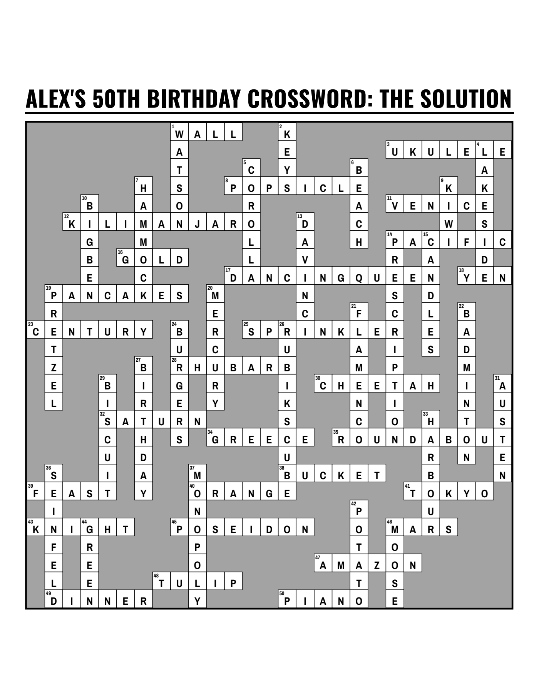
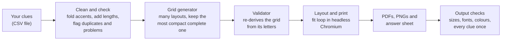

<div align="center">

# crossword-poster

**Turn a list of clues from friends and family into a print-ready crossword poster.**

[](https://github.com/faramarz/crossword-poster/actions/workflows/ci.yml)
[](LICENSE)
[](pyproject.toml)

<table>
<tr>
<td align="center"></td>
<td align="center"></td>
</tr>
</table>

*A fictional sample ("Alex's 50th"), built from [`examples/sample_birthday.csv`](examples/sample_birthday.csv). Left to right: the poster, then its answer sheet.*

</div>

---

## Why this exists

I built this to make a crossword poster for a family member's 50th birthday. Friends and family sent in clues and
answers about the guest of honour: shared jokes, old trips, favourite foods. I wanted every one of those answers on the
poster, printed large enough to hang on a wall and fill in with a pen at the party. It worked, and people loved it. I am
sharing the tool so you can do the same for your own birthday, anniversary, retirement or reunion.

You do not need to be a programmer. The [step-by-step guide](docs/GUIDE.md) starts from zero and covers collecting clues,
installing the tool, printing, and the party itself.

## What you get

Give it a spreadsheet with a **clue** column and an **answer** column. It writes these files:

| File | What it is for |
|---|---|
| `poster_24x36_grey_bleed.pdf` | **Send this to the print shop.** The poster plus 0.125 in of bleed (extra edge the shop trims off). |
| `poster_24x36_grey_trim.pdf` | The same poster at exactly its final size, for shops that add their own bleed. |
| `poster_24x36_grey_preview.png` | A picture of the poster to look at or share. |
| `answer_key_24x36_11x17.pdf` | The finished poster shrunk onto 11x17 in paper with every answer filled in. Keep it for the host. |
| `answer_sheet_letter.pdf` and `.png` | The filled grid on one letter page. Print it at home. |
| `actual_size_check_24x36.pdf` | A letter page printed at 100% scale. Shows the real square size and clue type, so you can judge them before paying for the big print. |
| `clues_and_answers.csv` | A numbered list of every clue and answer. Use it to proofread. |
| `details/` | Working files. You can ignore them. |

(File names change with your poster size and style. `grey` is the default style.)

## Quick start

**Never used a terminal?** Follow the [beginner guide](docs/GUIDE.md#4-install-the-tool) instead. It has exact steps for
macOS, Windows and Linux.

You need Python 3.9 or newer (see [Python versions](#python-versions) below).

**1. Install** (an isolated install with [pipx](https://pipx.pypa.io/) or [uv](https://docs.astral.sh/uv/)):

```bash
# with pipx
pipx install git+https://github.com/faramarz/crossword-poster

# or with uv
uv tool install git+https://github.com/faramarz/crossword-poster

# then, with either one, download the browser (once)
crossword-poster install-browser
```

No Git on your computer? Replace `git+https://github.com/faramarz/crossword-poster` with
`https://github.com/faramarz/crossword-poster/archive/refs/heads/main.zip`.

`install-browser` downloads Chromium, the browser the tool uses to lay out and print the poster. You do it once. It is a
download of about 300 MB. It runs Playwright's installer with the same Python as the tool, so it works for
pipx, uv and pip alike. If it ever fails, `crossword-poster doctor` prints the manual command as a fallback.

If your computer says `command not found` for `crossword-poster` after installing, the folder that pipx or uv installs
programs into is not on your PATH yet. Run `pipx ensurepath` (pipx) or `uv tool update-shell` (uv), then open a new
terminal window.

<details>
<summary>Plain pip in a virtual environment instead</summary>

```bash
python3 -m venv .venv
source .venv/bin/activate            # Windows: .venv\Scripts\activate
pip install git+https://github.com/faramarz/crossword-poster
crossword-poster install-browser
```

</details>

Check that everything works:

```bash
crossword-poster doctor
```

**2. See what it makes.** This builds the fictional sample in about 15 seconds:

```bash
crossword-poster sample --out my-first-poster --size 24x36
```

**3. Make your own.**

First write a starter file, then open it in Excel or Google Sheets and replace the example rows with your clues:

```bash
crossword-poster template my_clues.csv
```

Then build the poster (this is one long line; paste it as it is):

```bash
crossword-poster build --clues my_clues.csv --title "Sam's 50th Birthday" --subtitle "Clues from everyone who loves you" --size 24x36 --style grey --out poster/
```

The run ends with a plain-language summary: the files written, the size of each square, the clue type size, and any
answers that did not fit.

## Features

- **Every answer is used.** The grid generator searches many layouts and keeps the most compact one that holds all of your answers. If one cannot cross any other, it tells you which and why.
- **Made for printing.** Real vector PDFs with embedded fonts, 0.125 in bleed, and a trim-size copy.
- **Any poster size.** Tuned for 18x24, 24x36 and 36x48 inches. Other sizes (A2, A1, landscape) are scaled from the nearest one.
- **Three styles.** `grey` saves ink and is easy to write on. `black` is bold. `icons` is black with a cake and a party hat. Pick any colour with `--block-fill`.
- **A fit loop.** It picks the largest squares that still let every clue appear at a readable size.
- **A size check before you pay.** The actual-size page shows real squares and real type on your desk printer.
- **Checks you do not have to do by hand.** An independent validator re-derives the grid from its letters. A verifier checks page sizes, embedded fonts, colours, margins and that every clue appears exactly once.
- **Friendly errors.** Mistakes in your file or setup get a plain message and a "how to fix" line, not a traceback.
- **Private and offline.** Everything runs on your computer. Nothing is uploaded.
- **Open and tested.** MIT licence, bundled open fonts, unit tests on Python 3.9 to 3.14, end-to-end tests with real Chromium on Linux, and a real sample build on macOS and Windows in CI.

## Python versions

| Python | Status |
|---|---|
| 3.10 to 3.14 | Supported and tested in CI. |
| 3.9 | Still works and is tested, but Python 3.9 reached end of life in October 2025. It may be dropped in a future release. Prefer a newer Python if you can. |

## How it works



Developers: see [docs/ARCHITECTURE.md](docs/ARCHITECTURE.md).

## Command cheat sheet

| I want to... | Run |
|---|---|
| Check my computer is ready | `crossword-poster doctor` |
| See an example | `crossword-poster sample --out my-first-poster` |
| Get a starter clues file | `crossword-poster template my_clues.csv` |
| Build a poster | `crossword-poster build --clues my_clues.csv --title "Title" --out poster/` |
| Choose a size | add `--size 18x24` (or `24x36`, `36x48`, `16.5x23.4` for A2, `36x24` for landscape) |
| Choose a style | add `--style grey`, `black`, `icons` or `all` |
| Build several sizes at once | add `--size 18x24,24x36` |
| Get a different layout | add `--seed 2` |
| Stop if any answer does not fit | add `--require-all` |
| Use my own column names | add `--clue-column Question --answer-column Word` |
| See every option | `crossword-poster build --help` |

Full reference with every option, exit code and the CSV format: [docs/CLI.md](docs/CLI.md).

## Questions people ask

- **Do I need to know how to code?** No. Follow the [beginner guide](docs/GUIDE.md).
- **How many clues should I use?** About 30 to 60 for a 24x36 poster. See the [table in the guide](docs/GUIDE.md#how-many-clues-fit-each-poster-size).
- **Can answers have spaces or accents?** Yes. `Big Ben` becomes `BIGBEN` and the clue gets `(3,3)`. `Café` becomes `CAFE`. Digits are not allowed: spell numbers out.
- **Is my data private?** Yes. Nothing leaves your computer.
- **Something broke.** Run `crossword-poster doctor`, then see [Troubleshooting](docs/TROUBLESHOOTING.md).

## Contributing

Bug reports, new sizes, new styles and doc fixes are welcome. Start with [CONTRIBUTING.md](CONTRIBUTING.md). Please read
the [Code of Conduct](CODE_OF_CONDUCT.md). For security issues, see [SECURITY.md](SECURITY.md). Questions and ideas go to
[Discussions](https://github.com/faramarz/crossword-poster/discussions).

## Licence

The code is released under the [MIT licence](LICENSE). The bundled fonts, Archivo Narrow and Oswald, are licensed under
the SIL Open Font License 1.1 (OFL), which allows use in printed work and in your posters. Their licence texts are in
[`crossword_poster/fonts/`](crossword_poster/fonts/README.md). Dependencies are listed in
[THIRD_PARTY_LICENSES.md](THIRD_PARTY_LICENSES.md); none of the Python packages it depends on is copyleft.

## Acknowledgements

Thanks to everyone who sent in clues for the first poster, and to the people who proofread it. Thanks also to the
projects this tool stands on: [Playwright](https://playwright.dev/) and Chromium for layout and printing,
[pypdf](https://github.com/py-pdf/pypdf) and [pypdfium2](https://github.com/pypdfium2-team/pypdfium2) for PDF work,
[Pillow](https://python-pillow.github.io) for images, and the designers of
[Archivo Narrow](https://github.com/Omnibus-Type/ArchivoNarrow) and [Oswald](https://github.com/googlefonts/OswaldFont).

Made by Faramarz ([@faramarz](https://github.com/faramarz)).
