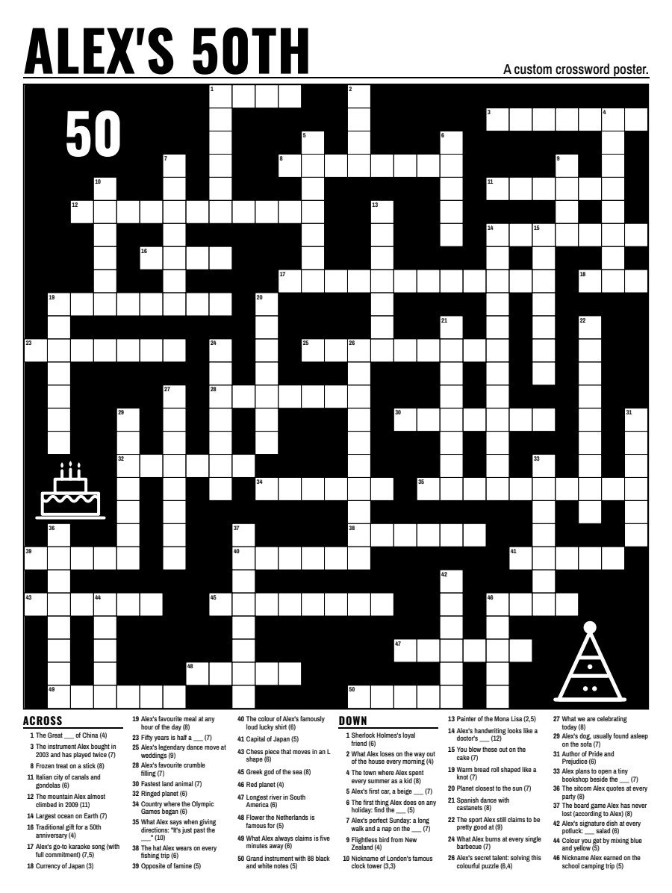

# Make a crossword poster for someone special

This guide takes you from "I had an idea" to "it is on the wall at the party". You do not need to be a programmer. If
you can fill in a spreadsheet and copy a few lines into a window, you can do this.

You will make a crossword poster whose clues come from the people who love the guest of honour. Everyone who sends a
clue gets to see it on the wall.

**What you need**

- A computer (Mac, Windows or Linux) with an internet connection for the one-time setup.
- A spreadsheet program (Excel, Numbers or Google Sheets). Google Forms is handy for collecting clues.
- About 30 to 60 clues. The guide shows how many fit each poster size.
- Two to four weeks before the party. More is better.

**The steps**

1. [Plan](#1-plan)
2. [Collect clues from friends and family](#2-collect-clues-from-friends-and-family)
3. [Clean and edit the clues](#3-clean-and-edit-the-clues)
4. [Install the tool](#4-install-the-tool) (once)
5. [Build the poster](#5-build-the-poster)
6. [Check before printing](#6-check-before-printing)
7. [Print](#7-print)
8. [At the party](#8-at-the-party)

Words used in this guide:

| Word | Meaning |
|---|---|
| **Clue** | The hint, such as "Where we met (5)". |
| **Answer** | The word that goes in the grid, such as "Paris". |
| **Grid** | The crossing squares where the answers go. |
| **Square** | One box in the grid. One letter goes in it. |
| **Poster** | The big printed sheet: title, grid and clues. |
| **Answer sheet** | A letter-size page with the grid filled in. |
| **Answer key** | The whole poster shrunk onto 11x17 inch paper, with the answers filled in. |
| **Trim** | The final size of the poster after the print shop cuts it, for example 24 x 36 inches. |
| **Bleed** | A thin extra border (0.125 in) around the poster that the shop cuts off. It stops thin white edges when the cut is not perfect. |

---

## 1. Plan

### Pick the date and work backwards

Start from the party date. This plan has slack in it. If you are short on time, you can squeeze it. Do not squeeze the
print shop step.

| When | What |
|---|---|
| 8 weeks before | Choose the poster size. Set up the clue form (step 2). Test it with one or two people. |
| 7 to 5 weeks before | Send the form. Give people about two weeks. Send one reminder. |
| 5 weeks before | Close the form. Clean and edit the clues (step 3). |
| 4 weeks before | Install the tool. Build a first poster. Ask one or two people to proofread it. |
| 3 weeks before | Finish the clues. Build the final poster. Run the actual-size check (step 6). |
| 2 weeks before | Send the file to the print shop (step 7). Ask for a quote and a turnaround time. |
| 1 week before | Pick up the poster. Buy pens and tape. Test-hang it. |
| Party day | Hang it up and have fun. |

**Allow for print shop lead time.** Same-day printing is common for plain paper. Mounting on foam board, online orders
and shipping take longer, often several days. Ask the shop when you will have it in your hands, then add a few spare
days in case something needs a reprint.

A tight schedule works too. The tool builds a poster in under two minutes, so the slow parts are people sending clues
and the print shop.

### How many clues fit each poster size?

Short answer: **30 to 60 clues is a good range for most posters.** More clues make smaller squares. Fewer clues make
bigger squares, and when there are very few the tool makes the clue text bigger so the poster does not look empty.

I measured this with version 1.0.0 by building made-up clue lists of 20 to 300 clues at three sizes, with the default
`grey` style. The clues averaged 6.6 words and the answers 6.7 letters. Your numbers will differ a little with your own
clue lengths and answers: longer clues and longer answers mean smaller squares.

**Square size in inches and millimetres (clue text size in points)**

| Clues | Grid (squares) | 18 x 24 in | 24 x 36 in | 36 x 48 in |
|---:|---|---|---|---|
| 20 | 17 x 15 | 1.00 in, 25 mm (21.0 pt, **blank foot**) | 1.35 in, 34 mm (27.0 pt, **blank foot**) | 2.02 in, 51 mm (40.5 pt, **blank foot**) |
| 40 | 21 x 24 | 0.81 in, 20 mm (10.4 pt) | 1.09 in, 28 mm (18.0 pt) | 1.64 in, 42 mm (21.4 pt) |
| 55 | 26 x 27 | 0.65 in, 17 mm (12.8 pt) | 0.88 in, 22 mm (18.0 pt) | 1.32 in, 34 mm (26.3 pt) |
| 70 | 30 x 31 | 0.56 in, 14 mm (11.3 pt) | 0.76 in, 19 mm (18.0 pt) | 1.15 in, 29 mm (23.3 pt) |
| 100 | 36 x 37 | 0.47 in, 12 mm (9.7 pt) | 0.64 in, 16 mm (18.0 pt) | 0.96 in, 24 mm (19.8 pt) |
| 150 | 45 x 42 | 0.38 in, 10 mm (9.4 pt) | 0.51 in, 13 mm (16.4 pt) | 0.76 in, 19 mm (19.4 pt) |
| 200 | 50 x 50 | 0.30 in, 8 mm (9.6 pt, **tight**) | 0.46 in, 12 mm (12.9 pt) | 0.69 in, 17 mm (14.7 pt, **tight**) |
| 250 | 57 x 56 | does not fit | 0.40 in, 10 mm (11.7 pt, **tight**) | 0.60 in, 15 mm (13.4 pt, **tight**) |
| 300 | 61 x 60 | does not fit | 0.38 in, 10 mm (10.6 pt, **tight**) | 0.56 in, 14 mm (12.2 pt, **tight**) |

One inch is 25.4 mm. A square of 0.6 in is about 15 mm. "Does not fit" means the build stops with a message and writes
no poster, because even the smallest allowed squares (0.3 in) and text (9 pt) would not hold the clues. "Blank foot"
means the poster has 8 percent or more of its height empty at the bottom, which the build reports as a warning. Only the
20 clue row has that, because there are so few clues for the size. "Tight" means the poster is below the size the tool
prefers for that poster size (see below). The build prints a warning, but the poster is still legible. A bigger poster
size never holds fewer clues than a smaller one, and its squares and text are never smaller.

**In real use, a 214-clue list fit on 24 x 36 in with 0.46 in (11.6 mm) squares and 12.3 pt clue text.** The
grid for it was 50 x 51 squares. On 36 x 48 the same list got 0.69 in (17.5 mm) squares and 13.8 pt text.

How to read this table:

- **Square size** is the width of one box. People write one letter in it. About 0.6 in (15 mm) or more is comfortable
  for a pen. Below about 0.5 in (13 mm), handwriting gets cramped. This is my judgement from the samples, not a hard
  rule. Check your own poster with the [actual-size page](#6-check-before-printing).
- **Clue text size** is in points. 12 pt is the size of ordinary book text. On a poster people read from an arm's length
  or more away, so 14 pt and up is comfortable. For a normal number of clues the tool uses up to 14 pt on 18 x 24, 18 pt
  on 24 x 36, or 27 pt on 36 x 48. The build never goes below 9 pt text or 0.3 in squares: if the clues would need less, it stops instead.
- **Empty space.** When you have few clues, the grid gets big squares and the clue text reaches its normal upper limit.
  If that would leave 8 percent or more of the height empty at the bottom, the tool makes the clue text bigger (up to
  1.5 times the normal limit, which is why the first row shows 27 pt and 40.5 pt) until the page is filled. If a poster
  is still 8 percent or more empty, the build says so. Then pick a smaller poster or add clues.
- **Preferred and minimum sizes.** Each poster size has a size it prefers: squares of at least 0.45 in and text of at
  least 11 pt on 24 x 36 (0.33 in and 9 pt on 18 x 24, 0.675 in and 16.5 pt on 36 x 48). If the clues do not fit at
  that size, the tool keeps shrinking, down to a minimum that is the same for every poster size: squares of 0.3 in and
  text of 9 pt. When it goes below the preferred size it says so in a warning. Below the minimum, the build stops.
- **Too many clues.** The tool warns above 250 clues and refuses more than 400. The refusal is only a safety limit. In
  my tests about 300 clues still fit on 24 x 36 and 36 x 48 with small squares (0.38 in on 24 x 36), and 350 was at the
  edge. A clue longer than 300 characters is skipped: shorten it.

**Good starting points**

| Poster | Inches | Centimetres | Good for |
|---|---|---|---|
| 18 x 24 | 18 x 24 | 46 x 61 | 30 to 70 clues (about 150 at most, with tiny squares). Fits a smaller wall or a table. Cheapest. |
| 24 x 36 | 24 x 36 | 61 x 91 | 40 to 150 clues, and up to about 250 with smaller squares. The classic "movie poster" size. Best all-round choice. |
| 36 x 48 | 36 x 48 | 91 x 122 | 70 to 200 clues, with big squares and big text. Big enough for a crowd. Costs more and needs a large wall. |

Outside North America you may prefer A sizes. A2 is `16.54x23.39` and A1 is `23.39x33.11` (in inches). Both work. See
the [FAQ](TROUBLESHOOTING.md#can-i-use-a2-a1-or-another-size).

### Very large lists (about 150 clues and more)

If you have a lot of clues, this is how to get the most onto one poster:

1. **Go up a size, not down.** A bigger poster always holds at least as many clues as a smaller one, with squares and
   text at least as big. For 200 clues or more, choose `--size 24x36` or `--size 36x48`. 18 x 24 only just manages 200
   (0.3 in squares, the smallest the tool allows) and does not fit 250.
2. **Expect smaller squares.** At 200 clues on 24 x 36 the squares are about 0.46 in (12 mm), which is
   workable for a pen but tight. At 250 they are 0.40 in and at 300, 0.38 in. The clue text is about 11 to 13 pt, like
   a book. The build warns when a poster is below the size the tool prefers.
3. **Know where the limit is.** Squares never go below 0.3 in and text never below 9 pt. In my tests about 300 clues
   was the most that fit on 24 x 36, and 350 only fit on one of two layouts. If the build says the clues do not fit,
   drop the weakest clues, or shorten long ones: shorter clues and shorter answers both help.
4. **Give the search time.** The grid search grows quickly with the number of clues. In my tests it took about 27
   seconds for 150 clues, 45 seconds for 200, 70 seconds for 250 and 2 to 3 minutes for 300, on a two-core computer, and
   it stops at 180 seconds by default. If you have more than 250 clues, pass `--time-limit 300` (seconds) to let it look
   longer for a tighter layout, or `--time-limit 60` for a quick answer. A tighter grid means bigger squares.
5. **Check the summary line.** The build prints the square size and clue text size. Open the actual-size page before you
   print.

### How many clues should I collect?

Collect more than you need. You will remove duplicates, fix mistakes and drop weak clues. A good rule of thumb is to
collect about one and a half times the number you want on the poster.

---

## 2. Collect clues from friends and family

You need a **clue** and an **answer** from each person. The easiest way is a Google Form. An email works too.

### Option A: a Google Form

Create a new form at [forms.google.com](https://forms.google.com) and copy this.

**Form title:** `A crossword for [Name]'s [50th birthday]`

**Form description:**

> We are making a crossword poster for [Name]'s [50th birthday] on [date]. It will be printed big and hung at the party,
> and [Name] will read it. Please send us a clue and its answer. Think of a memory, a joke, a favourite thing or a
> habit that only you would know. Send as many as you like (fill the form in again for each one). Please keep it kind:
> [Name] will read every clue. Deadline: [date].

**Questions**

| Question title | Type | Required | Help text to put under it |
|---|---|---|---|
| `Your name` | Short answer | Yes | Only I will see this. It is not printed on the poster. |
| `Clue` | Paragraph | Yes | The hint people will read. Example: `Our dog, usually found asleep on the sofa`. Do not put the answer in the clue. |
| `Answer` | Short answer | Yes | One to three words, letters only. No numbers. Example: `Biscuit`. The answer is the word that goes in the grid. |
| `Story` | Paragraph | No | Optional. Tell me the story behind it so I can check I have it right. |

**Name the two important questions exactly `Clue` and `Answer`.** When you download the responses, the question titles
become the column headings, and the tool finds columns called `clue` and `answer` on its own (capital letters do not
matter).

Under Settings, leave "Collect email addresses" off unless you need it, and turn on "Allow response editing" if you
want people to fix mistakes.

**An example to put in the form description**

> Example: Clue: `The Great ___ of China`. Answer: `Wall`. Another: Clue: `What we call the clock tower at
> Westminster`. Answer: `Big Ben`.

### Option B: an email or message

Copy this into an email or group chat. Ask people to reply with the same three lines for each clue.

> **Subject:** Help me make a crossword for [Name]'s [50th]!
>
> Hi everyone,
>
> I'm making a crossword poster for [Name]'s [50th birthday] on [date]. It will be printed big and everyone will fill it
> in at the party. I need your help!
>
> Please reply with one or more clues like this:
>
> Your name: Sam
> Clue: Our dog, usually found asleep on the sofa
> Answer: Biscuit
>
> The clue is the hint. The answer is the word that goes in the grid (letters only, no numbers). Funny memories, shared
> trips, favourite foods, catchphrases and nicknames all work well. Please keep it kind, because [Name] will read
> every one.
>
> Please send me yours by [date]. Thank you!

Copy the replies into a spreadsheet yourself, one clue per row, with columns `clue` and `answer`.

### Tips for good clues from your contributors

People often freeze when asked for "a clue". Give them prompts:

- Where did you first meet [Name]?
- What is a trip or a party you remember together?
- What does [Name] always order, cook or say?
- What is [Name]'s nickname, hobby or favourite song?
- What is something [Name] is famously bad (or great) at?
- What did [Name] teach you?

Ask for a mix: some clues about [Name], and some general knowledge (a capital city, a famous painter). The general
clues help people get started and give the personal clues crossing letters. Aim for about **60 to 80 percent personal
clues**.

Also ask the younger generation, the neighbours and the workmates. Different circles remember different things.

### Be kind and private

The guest of honour will read every clue at the party, in front of everyone. Before you add a clue, ask: would
[Name] smile at this? Would the whole room?

- Leave out anything embarrassing, hurtful or private. That includes health, money, ex-partners, and jokes about age or
  appearance that [Name] might not enjoy.
- Do not put home addresses, phone numbers or other private details on the poster.
- If a clue is a risk, cut it, or ask the person to write a gentler one. Do it privately and kindly.
- Tell contributors that their clues will be public at the party. The poster does not print who wrote each clue.
- Keep the form responses private. Do not share the sheet with the guest of honour!

The tool itself keeps your data private. It runs on your computer and uploads nothing.

### Export the responses to a CSV file

A **CSV file** is a plain spreadsheet file that every program can open. You need one to give to the tool.

**From Google Forms**

1. Open your form and go to the **Responses** tab.
2. Click the three dots and choose **Download responses (.csv)**.

Or click **Link to Sheets**, then in the sheet choose **File > Download > Comma Separated Values (.csv)**.

**From Google Sheets**

**File > Download > Comma Separated Values (.csv)**

**From Excel**

**File > Save As**, then under "Save as type" choose **CSV UTF-8 (Comma delimited) (\*.csv)**. Choose the "UTF-8" one
so names with accents (like Zoë or José) stay correct. See [Excel and accents](TROUBLESHOOTING.md#my-accented-letters-turned-into-strange-characters).

**From Apple Numbers**

**File > Export To > CSV**

Put the CSV in one folder, for example a new folder called `crossword` on your Desktop.

---

## 3. Clean and edit the clues

Open the CSV in your spreadsheet program. Work on a **copy** of the file and keep the original safe.

The tool needs two columns with these headings in the first row: **`clue`** and **`answer`**. Other columns (name,
timestamp, story) are fine and are ignored. If you named the form questions differently, rename the headings now. The
full list of accepted heading names is in the [CSV format reference](CLI.md#the-clues-file).

### Problems you will probably meet

Here is what shows up in real clue collections, and what to do about each.

| Problem | Example | What the tool does | What you should do |
|---|---|---|---|
| **The answer is in the clue box** (and the clue is in the answer box). Some people do it backwards. | Clue: `Paris`, Answer: `Capital of France` | **It cannot be sure, but it warns.** It warns when most rows look backwards, and names single rows whose answer is three or more words and whose clue is one word ("Row 7: the clue is just 'Paris' but the answer is 'Capital of France'"). Anything it misses would put `CAPITALOFFRANCE` in the grid. | Scan the answer column. Anything long, with a question mark, or like a sentence is probably a clue. Swap the cells. Sorting the sheet by the answer column makes these easy to spot. |
| **Duplicates** | Two people both send `Pineapple` | Keeps the first row and ignores the others, with a warning. | Read both clues and keep the better one. Put it first, or delete the other row. |
| **Near-duplicates** | `Biscuit` and `Biscuits` | Not detected. Both go in. | Look through the sorted answers and remove one. |
| **Answers with numbers** | `1976` or `50th` | **Skipped**, with an explanation. Answers must be letters. | Spell it out (`Nineteen seventy six`), or change the clue so the answer is a word. |
| **Very long answers** | A 34-letter word | Skipped above 20 letters. | Shorten the answer or change the clue. Answers of 4 to 10 letters fit best. |
| **Very short answers** | `Ö` | Skipped below 2 letters. | Use a longer answer. |
| **A clue that gives away an answer** | Clue: `Café in Rome` and Answer: `Café` | Flags clues that contain an answer as a whole word and lists them by row number in the build output (the full list is in `details/pool_report.json`). | Reword the clue so it does not contain its own answer or another answer on the poster. |
| **Inside jokes only one person gets** | `The thing Jo said at the 2009 barbecue` | Nothing. | Add a hint (`...at the barbecue, involving a goat`) or cut it. A few mysteries are fun. A poster full of them is not. |
| **Facts that might be wrong** | `Year the band split`, a person's name spelling | Nothing. It does not check facts. | Look up dates and spellings. Ask the clue's author if unsure. A wrong clue on a poster is a bad surprise. |
| **Clues with the wrong length** | `Dog (5)` but the answer has 7 letters | Corrects the number and warns. | Nothing, but fix the clue if the number was part of a joke. |
| **Apostrophes and hyphens** | `O'Brien`, `Jean-Luc` | Both go into the grid as letters only (`OBRIEN`, `JEANLUC`). | Only spaces separate words in the printed length, so `O'Brien` shows `(6)` and `Jean-Luc` shows `(4-3)`. To print something else, add an `enumeration` column. See [the CSV reference](CLI.md#the-clues-file). |
| **Rows with no clue or no answer** | A blank cell | Skipped, listed by row number. | Fill it in or delete the row. |

You do not need to type the length yourself. For each clue the tool adds a length at the end: `(7)` for one word, or
`(3,3)` for two words of three letters each (`Big Ben`). If you type the correct length yourself, it keeps yours.

### Writing good clues

Rewrite weak clues. The contributor will not mind.

- **Fill in the blank.** `Alex's first car, a beige ___` is easy to read and satisfying to solve.
- **Short and clear.** Aim for 12 words or fewer. Long clues take space and make the type smaller.
- **Say what kind of answer it is.** `Nickname of the clock tower at Westminster` points to a name, not a date or a
  place. The tool adds the length, such as `(3,3)`, for you.
- **Be fair.** A clue should be answerable by someone who knows the person, or can work it out from the crossing
  letters.
- **Mix personal and general.** About 60 to 80 percent personal is a good balance. The general clues are the glue.
- **Do not repeat the answer** in the clue, or use a word from another answer.
- **Keep names consistent.** Decide whether `Mum` or `Mom`, and whether it is `Mr Smith` or `Smith`, and use the same
  form everywhere.

### Before you move on

- [ ] The first row has the headings `clue` and `answer`.
- [ ] No answer is really a clue (no sentences, no question marks).
- [ ] No duplicates or near-duplicates.
- [ ] No digits in any answer.
- [ ] Every clue is kind, and would make the guest of honour smile.
- [ ] Names and facts are correct.
- [ ] 30 to 60 clues, or the number that suits your poster size.
- [ ] Saved as **CSV UTF-8**.

The tool also does a basic check when you build, and the summary lists every row it skipped.

---

## 4. Install the tool

You do this once. It takes about 10 minutes, mostly waiting for downloads. Pick your computer.

You will type commands into a window called the **terminal** (on Windows it is called Command Prompt). You type a line,
press Enter, and the computer does it. Copy and paste each line exactly. Do one line at a time.

The tool needs **Python 3.9 or newer** and **Chromium**, the open-source web browser engine that the tool uses to lay
out and print the poster. You do not need to learn either one. The steps below install them both.

If you already use Python tools, the [README](../README.md#quick-start) has a faster path using pipx or uv.

### macOS

**1. Open the Terminal.** Press **Command + Space**, type `Terminal`, then press **Enter**. A window opens with a line
waiting for you to type.

**2. Install Python.** Check what you have:

```bash
python3 --version
```

If it prints `Python 3.9` or higher (for example `Python 3.12.4`), skip to step 3. If it asks to install "developer
tools", click **Install** and wait, then run the command again. If it prints a version below 3.9, or you get an error,
download the macOS installer from [python.org/downloads](https://www.python.org/downloads/), open the file, and click
through the installer. Then **close the Terminal window and open a new one** and run `python3 --version` again.

**3. Make a folder for the project and go into it.**

```bash
mkdir -p ~/crossword
cd ~/crossword
```

**4. Create a private Python environment** (a tidy box so the tool does not mix with anything else on your computer),
then switch it on:

```bash
python3 -m venv .venv
source .venv/bin/activate
```

You should now see `(.venv)` at the start of the line. You must run the `source` line again every time you open a new
Terminal window.

**5. Install the tool.** This needs Git on a Mac. If you do not have it, the first command below will offer to install
it. If you would rather not, use the second option.

```bash
pip install git+https://github.com/faramarz/crossword-poster
```

No Git? Use this one instead:

```bash
pip install https://github.com/faramarz/crossword-poster/archive/refs/heads/main.zip
```

**6. Install Chromium** (a download of about 300 MB):

```bash
crossword-poster install-browser
```

If that command fails, run `crossword-poster doctor`: it prints the exact manual command for your computer.

**7. Check that it works:**

```bash
crossword-poster doctor
```

**What success looks like:**

```text
crossword-poster 1.0.0: checking this computer

  [ok] Python 3.13.16 (needs 3.9 or newer)
  [ok] crossword-poster 1.0.0 imports; libraries: playwright 1.63.0, pypdf 6.19.0, pypdfium2 5.14.0, Pillow 12.3.0
  [ok] Bundled fonts found (Archivo Narrow, Oswald)
  [ok] Chromium 141.0.7390.37

Everything is ready. Try:  crossword-poster sample --out my-first-poster
```

Your version numbers will differ. If any line says `[FAIL]`, read the `Fix:` line under it, do that, and run `doctor`
again. See [Troubleshooting](TROUBLESHOOTING.md).

### Windows

**1. Install Python.** Go to [python.org/downloads](https://www.python.org/downloads/windows/), download the latest
Python 3 installer, and open it. On the **first screen, tick the box "Add python.exe to PATH"**, then click **Install
Now**.

**2. Open Command Prompt.** Click the Start button, type `cmd`, and press **Enter**. A black window opens.

**3. Check Python.**

```bat
py --version
```

It should print `Python 3.9` or higher. If it says `py` is not recognised, close the window and open a new one, or run
the Python installer again and choose **Repair**.

**4. Make a folder for the project and go into it.**

```bat
mkdir %USERPROFILE%\crossword
cd %USERPROFILE%\crossword
```

**5. Create a private Python environment and switch it on.**

```bat
py -m venv .venv
.venv\Scripts\activate
```

You should see `(.venv)` at the start of the line. Run the second line again every time you open a new Command Prompt.

**6. Install the tool.** The ZIP link works on any Windows computer. (The `git+` form needs Git for Windows installed.)

```bat
pip install https://github.com/faramarz/crossword-poster/archive/refs/heads/main.zip
```

**7. Install Chromium** (a download of about 300 MB):

```bat
crossword-poster install-browser
```

If that command fails, run `crossword-poster doctor`: it prints the exact manual command for your computer.

**8. Check that it works:**

```bat
crossword-poster doctor
```

It should end with `Everything is ready.` If you see `[FAIL]`, follow the `Fix:` line, or see
[Troubleshooting](TROUBLESHOOTING.md#windows-problems).

> **Use Command Prompt, not PowerShell.** The lines above are written for Command Prompt. PowerShell treats a few of them
> differently, and it often refuses to switch on the environment ("running scripts is disabled on this system").

### Linux

These commands are for Ubuntu and Debian. For other distributions, install Python 3.9 or newer, `venv` and `git` with
your package manager.

**1. Open a terminal** (on Ubuntu, press **Ctrl + Alt + T**).

**2. Install Python and Git.**

```bash
sudo apt update
sudo apt install python3 python3-venv python3-pip git
python3 --version
```

The version must be 3.9 or higher.

**3. Make a folder, create a private Python environment and switch it on.**

```bash
mkdir -p ~/crossword
cd ~/crossword
python3 -m venv .venv
source .venv/bin/activate
```

You should see `(.venv)` at the start of the line.

**4. Install the tool.**

```bash
pip install git+https://github.com/faramarz/crossword-poster
```

**5. Install Chromium** along with the system libraries it needs. This uses `sudo` and may ask for your password:

```bash
crossword-poster install-browser --with-deps
```

On a distribution other than Ubuntu or Debian, run `crossword-poster install-browser`, and if Chromium will not
start, install your distribution's `chromium` or Google Chrome package. The tool finds those on its own, or you can
point to it with `CROSSWORD_POSTER_CHROMIUM` (see [the CLI reference](CLI.md#environment-variables)).

**6. Check that it works:**

```bash
crossword-poster doctor
```

### Come back later

Next time you want to use the tool, open the terminal, go to the folder, and switch the environment on again:

| System | Commands |
|---|---|
| macOS and Linux | `cd ~/crossword` then `source .venv/bin/activate` |
| Windows | `cd %USERPROFILE%\crossword` then `.venv\Scripts\activate` |

### Try the sample first

```bash
crossword-poster sample --out my-first-poster
```

It takes about 15 seconds and builds a fictional "Alex's 50th" poster. Open the `my-first-poster` folder and look at
the files. To open the folder from the terminal: `open my-first-poster` (macOS), `start my-first-poster` (Windows) or
`xdg-open my-first-poster` (Linux).

---

## 5. Build the poster

### Put your clues in the right place

Put your cleaned CSV in the `crossword` folder, for example `my_clues.csv`. If you want a blank starter file to type
into, the tool writes one:

```bash
crossword-poster template my_clues.csv
```

It makes a file with the headings `id,clue,answer` and three example rows. Open it in Excel, Numbers or Google Sheets,
replace the examples with your clues, and save as **CSV UTF-8**:

- **Excel:** File > Save As > "CSV UTF-8 (Comma delimited) (\*.csv)"
- **Google Sheets:** File > Download > Comma Separated Values (.csv)
- **Numbers:** File > Export To > CSV

If your file already has `clue` and `answer` headings (for example from Google Forms), skip the template and use your
file.

### Run the build

```bash
crossword-poster build --clues my_clues.csv --title "Sam's 50th Birthday" --subtitle "Clues from everyone who loves you" --size 24x36 --style grey --out poster
```

What each part means:

| Part | Meaning |
|---|---|
| `--clues my_clues.csv` | Your file. |
| `--title "..."` | The big title across the top. Keep the quotes. |
| `--subtitle "..."` | A short line beside the title. It wraps onto two lines if it is long. |
| `--size 24x36` | The poster size in inches: width x height. |
| `--style grey` | The look (see below). |
| `--out poster` | The folder where the results go. It is created for you. |

It takes from 10 seconds to a couple of minutes, depending on how many clues you have. It prints six steps as it goes.

### Read the summary

This is the complete output of `crossword-poster sample --out my-first-poster`, copied as it was printed. Only the folder
name in the "Your files are in" line is changed to an example, and the times will be different on your computer. Your own
build prints the same six steps and the same summary:

```text
Building the sample poster. The clues file it uses was copied to my-first-poster/sample_birthday.csv so you can see the format.

[1/6] Reading your clues
  54 usable clues from 54 rows

[2/6] Building the crossword grid (54 answers; this can take a minute for big lists)
  window 35x34: 803 complete layouts in 1000 attempts
  54 words in a 27 x 27 grid (seed 1, 3.54s)

[3/6] Checking the grid
  grid is valid: every word crosses, every clue matches

[4/6] Printing the poster(s) with Chromium: 18x24 (grey)
  18x24: squares 0.627 in, clue text 14.0 pt

[5/6] Making the answer sheet and the actual-size check page

[6/6] Checking the finished files
All 21 output checks passed.

Done in 8s. Your files are in: /home/you/crossword/my-first-poster

  poster_18x24_grey_bleed.pdf    PRINT THIS: 18.25 x 24.25 in, with 0.125 in bleed
  poster_18x24_grey_trim.pdf     18 x 24 in, no bleed (for printers that add their own)
  poster_18x24_grey_preview.png  picture preview of the poster
  answer_key_18x24_11x17.pdf     answer key, scaled to 11 x 17 in
  actual_size_check_18x24.pdf    letter page to print at 100% and judge the real sizes
  answer_sheet_letter.pdf        answer sheet (filled grid) on one letter page
  answer_sheet_letter.png        picture of the answer sheet
  clues_and_answers.csv          numbered list of every clue and answer
  details/                       working files (grid.json, checks, one folder per size and style)

Grid: 27 x 27 squares, 54 words.
Poster 18x24: each square is 0.627 in (15.9 mm); clue text is 14.0 pt.
Every answer was placed.
Output checks: all passed.
Before ordering a big print, print the actual-size check page at 100% and look at the real sizes.
```

What to look for:

- **`Every answer was placed.`** Good. Every clue you gave is on the poster.
- **`each square is ... in`** and **`clue text is ... pt`**. Compare with the [table above](#how-many-clues-fit-each-poster-size).
- **`Output checks: all passed.`** The tool checked page sizes, fonts, colours, margins and that every clue appears
  exactly once. If it says `SOME FAILED`, look at the PDFs carefully before printing and see
  [Troubleshooting](TROUBLESHOOTING.md).
- **Rows that were skipped** appear earlier in the output, such as `skipped row 4 ('1976'): the answer contains a
  digit`. Fix them in your spreadsheet and build again.

Open `poster/poster_24x36_grey_preview.png` to see the whole poster. Open the PDFs in your web browser or PDF viewer.

### Choose a size

Use `--size WIDTHxHEIGHT` in inches. 18x24, 24x36 and 36x48 are the sizes the layout is tuned for. Other sizes work too
(`--size 16.54x23.39` for A2, `--size 36x24` for a landscape poster). To compare sizes in one go: `--size 18x24,24x36`.

### Choose a style

| Style | Looks like | Pick it when |
|---|---|---|
| `grey` (default) | White squares on mid-grey blocks. | You want the safest choice. It uses far less ink than black, prints evenly, and is easy to write on. |
| `black` | White squares on solid black blocks. | You want a bold, dramatic poster that reads from across the room. Large black areas can print streaky on some printers, so ask the shop for a test. |
| `icons` | Black blocks with a cake and party hat drawn in. Add `--spot-text 50` to reverse a number out of a big black area. | It is a birthday and you want it playful. |
| `all` | All three. | You want to compare before you decide. |


*The `black` style at 18 x 24.*



*The `icons` style with `--spot-text 50`. The black and grey styles are on the [README](../README.md).*

You can set your own block colour with `--block-fill "#c8d6e5"` (any web colour). Pick a light or mid tone so letters
and numbers stay clear. Run the actual-size check afterwards.

### If some words do not fit

Usually every answer fits. If one does not, the tool tells you. For example:

```text
  2 answer(s) could not be placed:
    - Zzyzx (row 8): shares no letters with the other answers, so it cannot cross any of them
    - Cat (row 6): could not be fitted into the grid
  To fit them: choose a bigger --size, use fewer or shorter answers, raise --attempts, or try another --seed.
```

It still builds a poster, without those answers. What to do:

1. **Change the answer.** An answer that shares no letters with any other cannot cross. Reword the clue so the answer
   has common letters (A, E, R, S, T, N), or drop it.
2. **Try a different layout:** add `--seed 2` (or 3, 4...). Each seed gives a different grid.
3. **Search harder:** add `--attempts 3000`.
4. **Use fewer or shorter answers.**
5. **Stop on any miss:** add `--require-all`. The build then stops with an error instead of leaving answers out.

The row number is the number you see in your spreadsheet.

---

## 6. Check before printing

Do this before you order. It costs a few cents of paper and can save you a poster.

### The actual-size check

Open `actual_size_check_24x36.pdf` (the name changes with your size). It is a letter-size page that shows part of the
grid and part of the clue list at their true size on the real poster.

1. Print it. In the print window, choose **Actual size** or **100%**. **Do not choose "Fit to page" or "Shrink to fit"**.
   That would change the size and make the check useless. (US Letter paper is 8.5 x 11 in. On A4 paper, choose
   "Actual size" as well. The edges may be cut off by a few millimetres. That is fine.)
2. Measure the black bar at the top. It must be **exactly one inch (25.4 mm)** long. If it is not, the printer rescaled
   the page. Fix the print setting and print again.
3. Look at the real squares. Pick up a pen and try writing a letter in one. Is there room?
4. Look at the real clue text. Hold the page at arm's length. Can you read it?
5. If it is too small, go back to step 5 and choose a smaller poster size, fewer clues, or shorter clues.

### Proofread

Open `clues_and_answers.csv`. It lists every clue and answer, in order, with the number and direction (across or down)
they have on the poster.

- Read every clue out loud.
- Check every answer and spelling, especially names.
- Check the facts.
- Look for clues that give away another answer.
- Ask a second person to read it. Fresh eyes catch typos.
- Look at the preview PNG. Does the poster look balanced?
- Solve a few clues yourself using the answer sheet to be sure the answers fit.

If you change a clue, fix it in your spreadsheet and **build again**. A new build replaces the old files.

---

## 7. Print

### Which file to send

| File | Send it when |
|---|---|
| `poster_24x36_grey_bleed.pdf` | **Almost always.** It is the poster plus 0.125 in of bleed on every side (so 24.25 x 36.25 in for a 24 x 36 poster). Ask the shop to trim it. |
| `poster_24x36_grey_trim.pdf` | The shop says it adds its own bleed, or cannot handle bleed. It is exactly 24 x 36 in. |

When in doubt, ask the shop which they prefer, and send the matching file.

### What to tell the print shop

Copy this, fill in the size, and send it with the PDF:

> Hi! I'd like one poster printed from the attached PDF.
>
> - **File:** poster_24x36_grey_bleed.pdf
> - **Final size:** 24 x 36 inches. The PDF is 24.25 x 36.25 inches because it includes 0.125 in bleed on every side.
>   Please trim to 24 x 36.
> - **Scale:** 100%. Please do not scale, "fit to page" or resize.
> - **Colour:** black and white / grayscale. The file only has black, white and grey. Please do not colour-manage.
> - **Paper:** matte or uncoated paper, please, not glossy or satin.
> - **No lamination.** People will write on it with pens.
> - **Optional:** mount on foam board, matte, with no laminate.
> - Could you tell me the price and when it will be ready?

Why these choices:

- **Matte, uncoated paper** takes pen ink and does not glare under party lights. Glossy paper shows reflections and
  fingerprints, and pen ink may smear.
- **No lamination.** Laminate is slippery. Ink sits on top and rubs off.
- **Grayscale.** The poster is black, white and grey. A colour printer should not add a colour cast to the greys.
- **Foam board** keeps the poster flat and stiff and lets you stand it on an easel. It adds cost and is optional.

The shop can also print a small proof if you ask. Or print the `actual_size_check` page and the 11x17 answer key at home
as a free proof.

### Typical costs and turnaround

These are general ranges. They **vary** by country, shop and paper. Always ask for a quote.

| | Typical range |
|---|---|
| 18 x 24 paper poster | Low. Often about US$10 to $25. |
| 24 x 36 paper poster | Often about US$15 to $40. |
| 36 x 48 paper poster | Higher. Often about US$30 to $80. |
| Mounting on foam board | Adds about US$20 to $60 depending on size. |
| Turnaround | Same day to three business days for plain paper in a local shop. Several days for foam board, online orders and shipping. |

Local print and copy shops, office-supply stores and online poster services all do this. A shop that prints
architectural drawings ("plotter prints") is a good fit for black-and-white work.

### Print at home: the answer sheet and key

- **`answer_sheet_letter.pdf`**: the filled-in grid on one letter page. Print it on any home printer. Fit-to-page is fine
  for this one. Tape it to the back of the poster, put it in an envelope, or print several for people who get stuck.
- **`answer_key_24x36_11x17.pdf`**: the whole poster shrunk to 11x17 in, with the answers filled in. Print it at a copy
  shop or on a printer that takes 11x17 paper. This is the host's cheat sheet. If you only have letter paper, use the
  answer sheet instead.

You can print the answer sheet right away, or hold it back and **reveal it at the end**. It makes a fun finale.

---

## 8. At the party

### Ideas

- **A pen station.** Hang the poster at chest height with a few pens tied to it with string, or a cup of pens on a
  table beside it. Fine-tip felt pens or gel pens write well on matte paper. Test your pens on the proof first.
- **Give each team a colour.** Different pens show who got what.
- **Find your own clue.** Ask every contributor to find their clue and solve it. People love seeing their words on the
  poster.
- **Let the guest of honour start.** Or save the last few clues for them.
- **The reveal.** Pull out the answer sheet at the end. Read out the answers and the stories behind them.
- **A prize.** A small prize for the most clues solved, or for the funniest wrong guess.
- **Keep it.** Photograph the finished poster. Frame it, or roll it up as a keepsake.
- **Hang it safely.** Use painter's tape or removable adhesive strips, or mount it on foam board and stand it on an
  easel. A big sheet of paper droops, so tape it along the top and bottom.

### Party-day checklist

- [ ] Poster collected and checked for damage.
- [ ] Answer sheet printed (and a spare copy).
- [ ] 11x17 answer key for the host.
- [ ] Pens, fine-tip markers and a cup or string to hold them.
- [ ] Painter's tape, removable strips or an easel.
- [ ] A wall or board at chest height, with a spot of good light.
- [ ] A few chairs close by for people who want to sit and solve.
- [ ] A phone or camera for the "before and after" photos.
- [ ] A small prize, if you plan one.
- [ ] A moment in the schedule to introduce it.

Have a wonderful party.

---

## Where to go next

- Something went wrong: [Troubleshooting](TROUBLESHOOTING.md).
- Every command and option: [CLI reference](CLI.md).
- Want to change the tool: [CONTRIBUTING](../CONTRIBUTING.md) and [ARCHITECTURE](ARCHITECTURE.md).
